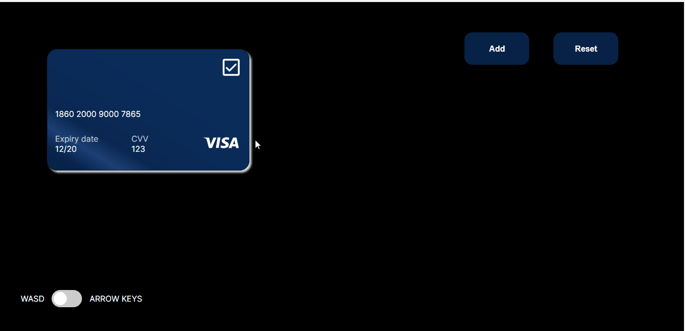

# MovingBoxes

A tool which has random cards moving with keyboard events and major funcionalities.


## Screenshots




## Tech Stack

**Client:** React, Vite, SCSS, Typescript


## Installation

To Install the project : 


1. 

```bash
  git clone https://github.com/sidv1905/onboarding-app
  
  cd <Folder_name>

  
```

2. 

```bash

  npm install

  npm run dev
  
```


## Authors

- [@sidv1905](https://www.github.com/sidv1905)


## Feedback

If you have any feedback, please reach out to us at sidvarangaonkar1905@gmail.com


## 🚀 About Me
I'm a full stack developer based in India, Spending majority of time with NextJS, React, Javascript and Python...

Connect with me on [linkedin](https://www.linkedin.com/in/siddharth-varangaonkar-9b4a3a150/)